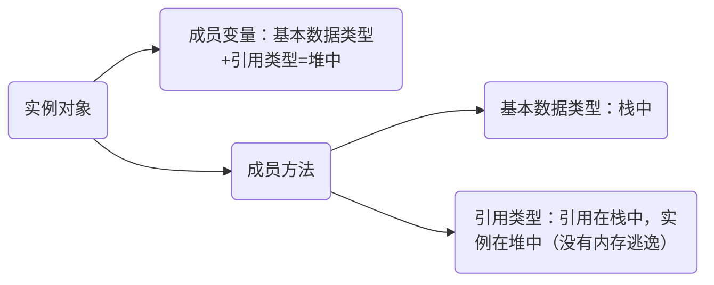

# JMM

## JMM内存模型

一组规则或规范，他规范了各个变量的访问方式（实例字段、静态字段、数组对象），规定所有变量放主存，所有线程都可以访问，线程对变量的操作必须在工作内存中。

变量： 主内存（拷贝）==> 工作内存 ==> 主内存（操作）

## 主内存

线程创建的实例对象。不管实例是成员变量、局部变量、也包括类信息、常量、静态变量。

## 工作内存

主内存变量的副本拷贝，每个线程只能访问自己的工作内存

## 对象在内存中是怎么存放的？

## 用户级线程、内核级线程

以4G内存为例，用户空间：3G（ox00000000~oxc000000），内核空间：1G（oxc0000000~oxffffffff）

线程上下文切换涉及用户态到内核态转换：用户空间 -->内核空间

上下文切换：线程间切换需要提前保存上一个任务的状态，以便于后面切换回这个任务，再次载任务状态

​                      任务从保存再到加载过程，就是一次上下文切换

### 用户级线程(User-Level Thread)-----1.2版本之前

由用户程序实现，不依赖于内核或操作系统

进程利用自己的线程库控制用户线程（创建、销毁、调度等）

所有的线程在进程里排队依次执行 -->  一个线程阻塞，全部阻塞  -->  不用和内核态的切换

### 内核级线程(Kernel-Level Thread)----1.2版本之后

由操作系统实现

