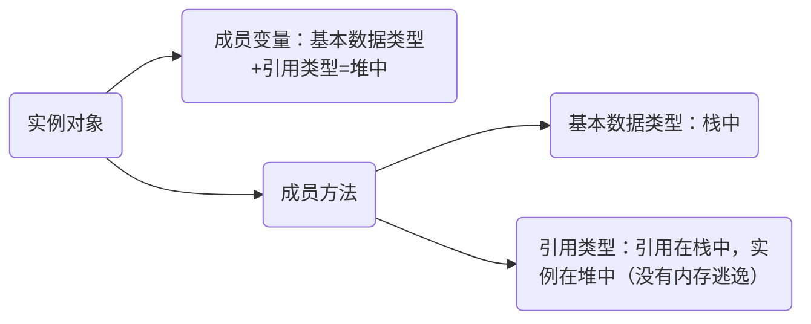

# JMM

## JMM内存模型

一组规则或规范，他规范了各个变量的访问方式（实例字段、静态字段、数组对象），规定所有变量放主存，所有线程都可以访问，线程对变量的操作必须在工作内存中。

变量： 主内存（拷贝）==> 工作内存 ==> 主内存（操作）

## 主内存

线程创建的实例对象。不管实例是成员变量、局部变量、也包括类信息、常量、静态变量。

## 工作内存

主内存变量的副本拷贝，每个线程只能访问自己的工作内存

## 对象在内存中是怎么存放的？

