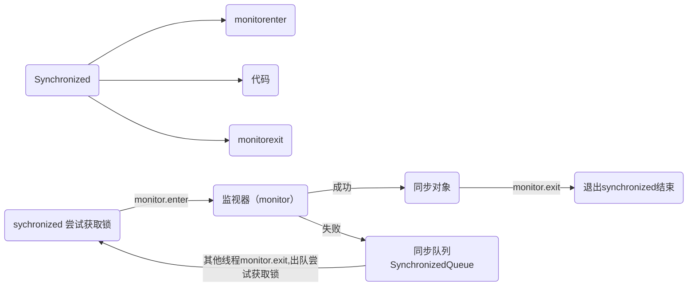

# Synchronized----对象锁




问题：对象存在哪里 ?

1. 实例对象在堆中
2. 引用在栈中
3. 元数据、class方法在方法区/元空间

 如果发生内存逃逸：则都存储在栈中


## Synchronized字段名关键字

1. Synchronized修饰代码快
   * 关键字：monitorenter、monitorexit  	
2. Synchronized修饰方法
   * 关键字：ACC_SYNCHRONIZED （JVM 通过ACC_SYNCHRONIZED判断一个方法是不是同步方法）


## 锁的粗化

1. 一堆的StringBuffer.append("")

## 锁的消除（内存逃逸时进行锁的消除）

1. JIT在即时编译器进行上下文扫描，去除不可能存在共享资源的锁
   例如：

   ```java
   Synchronized(new Object()){
       #每次都是新对象，锁消除
   }
   ```

   

## 锁的膨胀

膨胀过程：无锁 --> 偏向锁 --> 轻量级锁 --> 重量级锁


1. 偏向锁：大多数情况下，一个线程会多次重复进入锁，而且不存在多线程竞争
   减少CAS造作耗时
2. 轻量级锁： 绝大部分情况下，整个同步周期内不存在竞争，为了避免线程真实的操作系统层面挂起，会进行自旋
   挂起会涉及到：用户态 --> 内核态
3. 重量级锁：挂起时。需要进行上下文切换。