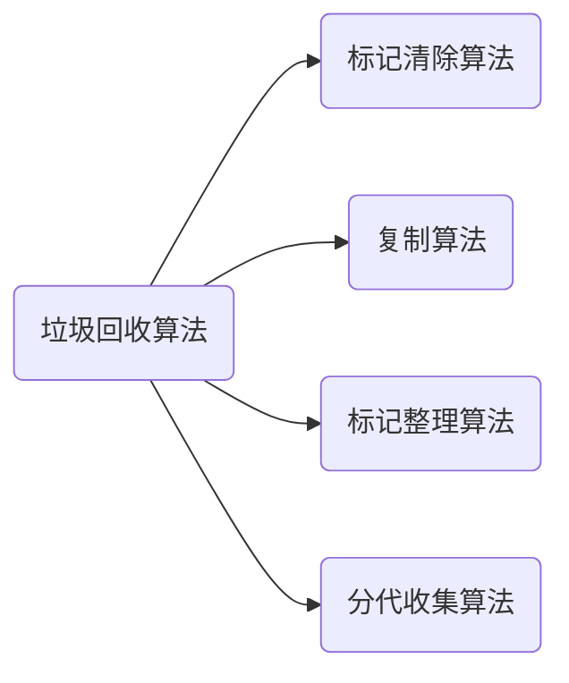

# 垃圾回收算法

### 算法

### 标记--清除算法

1.  给垃圾对象加标记
2.  GC时，回收被标记的对象

优点：简单、高效

缺点：产生大量不连续的碎片

### 复制算法（比 标记--清除算法、 分代收集算法快10倍以上）

1. 将空间分为A、B两块区域
2. 对象只存储在A区
3. 当A空间不足时，将非垃圾对象(还存活的对象)复制到B区
4. GC时，将整块A区回收
5. 轮换(只存在B区)

### 标记--整理算法

1. 前阶段类似标记--清除算法，标记可回收对象（垃圾对象）
2. 移到未被标记的对象，在一起
3. 清除无用空间

### 分代收集算法

根据对象年龄，将堆分为新生代、老年代，不同的年龄代采用不同的垃圾回收算法。

新生代：因为垃圾对象比较多，选择复制算法

老年代：因为对象存活几率高，选择 “标记--清除算法” 或者 "分代收集算法"