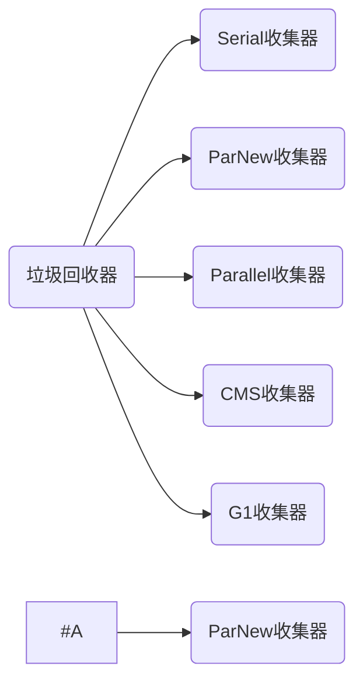

# 垃圾回收器（垃圾回收算法是方法论，垃圾回收器是具体实现）

## Serial收集器(串行  -XX:+UseSerialGC -XX:+UseSerialOldGC)

Serial Old收集器是Serial收集器的老年代版本

新生代：复制算法
老年代：标记-整理算法

## ParNew收集器(-XX:+UseParNewGC)

Serial收集器的多线程版本，线程数==cpu核数

新生代：复制算法
老年代：标记整理算法

## Parallel Scavenge收集器(-XX:+UseParallelGC(年轻代),- XX:+UseParallelOldGC(老年代))

Parallel Old收集器是Parallel Scavenge收集器的老年代版本

新生代：复制算法
老年代：标记整理算法

目标：高吞吐量（CPU利用率高）

## CMS收集器（Concurrent Mark Sweep）(-XX:+UseConcMarkSweepGC(old))

标记-清除算法

目标：最短停顿时间

只能用在老年代、不能用在年轻代

优点：并发收集、低延迟
缺点：

* 标记清除产生空间碎片, 需要重新整理空间-XX:+UseCMSCompactAtFullCollection
* 跟CPU抢资源
* 浮动垃圾（并发清理阶段产生的垃圾）要等到下一次gc才能回收 
* 第一次垃圾还未结束，又触发了垃圾回收--是"concurrent mode failure"，此时不再用CMS，改为serial old

## G1收集器(-XX:+UseG1GC)

Garbage-First：在指定的时间里，回收价值最大的Region(筛选回收阶段做计算)

复制算法：一个Region里存活的对象复制到另一个Region.(不会有空间碎片)

Region区：2048个，-XX:G1HeapRegionSize指定大小。Redion被回收之后重新开始，可能是老年代、也可能是年轻代
Humongous区：放大对象(大小超过Region 50%)，目的：节约老年代空间（老年代不足导致的gc）

-XX:MaxGCPauseMillis指定回收停顿时间，这个参数可能导致回收部分Region。所以“筛选回收阶段”会对每个Region的回收价值和成本进行排（回收价值最大）。

### G1垃圾回收器分类

1. YoungGC

   新生代空间默认堆的5%；指定大小：-XX:G1NewSizePercent
   如果时间远远小于 -XX:MaxGCPauseMills，没有必要直接YoungGC

   

2. MixedGC
   老年代空间达到阈值（-XX:InitiatingHeapOccupancyPercen），回收Young区、old区、Humongous区。
   复制算法：各个Region存活的对象拷贝到新的Region。弱Region不够，触发Full GC.

3. Full GC
   stop the world. 整理出新的Region给下一次mixedGC

## GC组合

