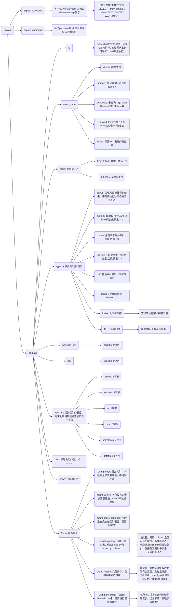

```mermaid
graph LR
A("Explain")-->B1("explain extended")
A-->B2("explain partitions")
A-->B3("explain")
B1-->B11("多了优化查询的信息 并通过show warnings显示")
B11-->B12("EXPLAIN EXTENDED SELECT * from explain1 where f1='f1';SHOW WARNINGS;")
B2-->B21("多了partitions字段 显示查询将访问的分区")
B3-->B31("id")
B31-->B311("select出现的先后顺序，id越大越先执行，id相同从上到下执行，null最后执行")
B3-->B32("select_type")
B32-->B321("simple: 简单查询")
B32-->B322("primary: 复杂查询，最外层的select")
B32-->B323("subquery: 子查询，在select中=====即不再form中")
B32-->B324("derived: from中的子查询====临时表===派生表")
B32-->B325("union: 除第一个表外的其他表")
B3-->B33("table: 要访问的表")
B33-->B331("from子查询: <dervivedN> 其中N对应id列")
B33-->B332("union: <union1,2> 1、2对应id列")
B3-->B34("type: 关联类型/访问类型")
B34-->B341("NULL: 优化阶段直接得到结果，不需要执行阶段去查索引和表")
B34-->B342("system: const的特例,表里只有一条数据,数量<=1")
B34-->B343("const: 主键或者唯一索引=常量,数量<=1")
B34-->B344("eq_ref: 主键或者唯一索引=变量/连接,数量<=1")
B34-->B345("ref: 普通索引或唯一索引的前缀")
B34-->B346("range：范围查询,in between >  <")
B34-->B347("index: 全索引扫描")
B347-->B3471("查询的所有字段都有索引")
B34-->B348("ALL：全表扫描")
B348-->B3481("查询的字段 有点不是索引")
B3-->B35("possible_key")
B35-->B351("可能用到的索引")
B3-->B36("key")
B36-->B361("真正用到的索引")
B3-->B37("key_len: 用到索引的长度，用来判断用到联合索引的几个字段")
B37-->B371("tinyint: 1字节")
B37-->B372("smallint: 2字节")
B37-->B373("int: 4字节")
B37-->B374("date: 3字节")
B37-->B375("timestamp: 4字节")
B37-->B376("datetime: 8字节")
B3-->B38("ref: 等号右边的值，如：const")
B3-->B39("rows: 扫描的函数")
B3-->B3a("Extra: 额外信息")
B3a-->B3a1("Using index: 覆盖索引，字段完全被索引覆盖，不用回表查")
B3a-->B3a2("Using where: 字段没有完全被索引覆盖，where来过滤数据")
B3a-->B3a3("Using index condition: 字段没有完全被索引覆盖，需要回表查")
B3a-->B3a4("Using temporary: 创建了临时表，例如group by和order by、distinct")
B3a4-->B3a41("性能差，案例：distinct后面没有加索引，形成临时表，优化思路: distinct后面加索引，直接在索引树中去重，无需将临时表")
B3a-->B3a5("Using filesort: 文件排序，在磁盘中完成排序")
B3a5-->B3a51("性能差，案例:order by后面没有加索引，在磁盘排序，优化思路: order by后面加索引，优化成using index")
B3a-->B3a6("Using join buffer【Block Nested Loop】: 需要进行嵌套循环计")
B3a6-->B3a61("性能差，案例: joi两边都会加索引，优化思路：关联字段加索引")
```

