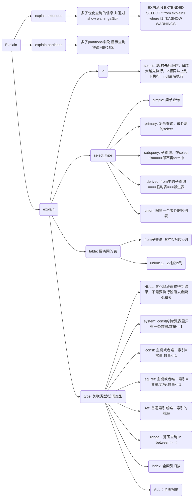

```mermaid
graph LR
A("Explain")-->B1("explain extended")
A-->B2("explain partitions")
A-->B3("explain")
B1-->B11("多了优化查询的信息 并通过show warnings显示")
B11-->B12("EXPLAIN EXTENDED SELECT * from explain1 where f1='f1';SHOW WARNINGS;")
B2-->B21("多了partitions字段 显示查询将访问的分区")
B3-->B31("id")
B31-->B311("select出现的先后顺序，id越大越先执行，id相同从上到下执行，null最后执行")
B3-->B32("select_type")
B32-->B321("simple: 简单查询")
B32-->B322("primary: 复杂查询，最外层的select")
B32-->B323("subquery: 子查询，在select中=====即不再form中")
B32-->B324("derived: from中的子查询====临时表===派生表")
B32-->B325("union: 除第一个表外的其他表")
B3-->B33("table: 要访问的表")
B33-->B331("from子查询: <dervivedN> 其中N对应id列")
B33-->B332("union: <union1,2> 1、2对应id列")
B3-->B34("type: 关联类型/访问类型")
B34-->B341("NULL: 优化阶段直接得到结果，不需要执行阶段去查索引和表")
B34-->B342("system: const的特例,表里只有一条数据,数量<=1")
B34-->B343("const: 主键或者唯一索引=常量,数量<=1")
B34-->B344("eq_ref: 主键或者唯一索引=变量/连接,数量<=1")
B34-->B345("ref: 普通索引或唯一索引的前缀")
B34-->B346("range：范围查询,in between >  <")
B34-->B347("index: 全索引扫描")
B34-->B348("ALL：全表扫描")
```

