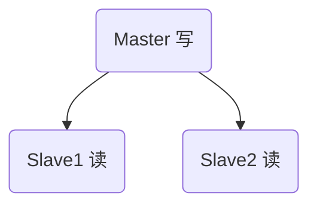

# Redis集群模式

## 主从模式



## 流程

客户端连接Master, Master分配操作

1. 写：Master写入数据并同步到Slave
2. 读：Master将读命令分配给Salve

### 优缺点

1. 优点： 读写分离，效率高；数据热备份

2. 缺点：Master节点宕机，无法自动选举新的Master

   ​           Master只有一个，写命令存在性能瓶颈

   ​           全量同步存在卡顿(秒级、或者毫秒级)

## psync 命令 

### Slave发送的命令

1. slave从未发起同步或SLAVEOF no one命令，同步命令：PSYNC ? -1

2. Slave有曾经从Master获取过数据，同步命令：psync runid offset

3. Master收到以上两个请求，响应参数：

   ```shell
   +FULLRESYNC <runid> <offset>：将进行全量同步，runid为Master节点id,Slave将其保存下来，下次发起同步请求需要用到
   +CONTINUE： 将进行增量同步
   -ERR： 版本错误，无法识别PSYNC命令
   ```

### 参数说明

1. offset复制偏移量(查看: info replication)
   Master的offset: 
   Slave的offet:  从库已同步的字节数

2. replication backlog buffer（复制积压缓冲区）

   所有Salve共用一份
   FIFO队列，大小由配置参数repl-backlog-size指定，默认大小1MB。所以只能存储最近的命令（包含offset和每个offset对应的命令）

3.  run_id(服务器运行的唯一ID)(查看: info server)
   每个redis实例启动时，都会生成一个长度为40的唯一字符串
   注意点：版本 < Redis4.0; redis重启时，runid会变，导致全量同步

### Master处理Psync命令流程


### 全量复制(PSYNC ? -1)

时机：Slave第一次连接Master或者Slave宕机太久后重启（offset不在repl_back_buffer）

```sequence
title: redis主从复制之全量同步
participant Slave
Participant Master

Slave->Master: 0:建立socket长连接
Slave->Master: 1:psync第一次同步请求
Master->Master: 2:收到psync命令，bgsave生成RDB快照
Master->Master: 3:生成快照期间或者之后的写命令放入repl_back_buffer
Master-->Slave: 4:发送RDB快照
Slave->Slave: 5:flush old data
Master-->Slave: 6:send buffer 发送bgsave之后的命令
Slave->Slave: 7:将buffer也加载到RDB中和内存中
Master-->Slave: 8:Socket长连接时时向Slave同步数据


```


## 增量同步 (psync runid offset)

增量同步时，对比runid和offset

1. runid不一样：说明进行过Master切换了，需要进行全量同步
2. offet不在repl_back_buffer: 说明宕机太久了，需要进行一次全量同步

```sequence
title: redis主从复制之增量同步
participant Slave
Participant Master

Slave->Master: 0:连接断开
Master->Master: 1: Master时时将最新执行的命令写入repl_back_buffer
Slave->Master: 2:重新建立socket连接
Slave->Master: 3:psync runid offset
Master->Master: 4:判断offet是否在repl_back_buffer中,如果不在则进行全量同步，详见上图，否则进行下一步增量同步
Master-->Slave: 将offet之后的数据一次性发送给Slave
Master-->Slave: Socket长连接时时向Slave同步数据
```


## todo Redis4.0 p3sync命令区别


## 哨兵模式

### 概念

如上诉可知，主从模式下，只起到读写分离和备份的作用，当Master宕机时，无法重新选举（Slave无法成为新的Master）,需要人工介入。这样在生产环境下不可靠，于是诞生了哨兵模式，监控各个节点，当Master挂了之后，Slave间被选举成为新的Master。

sentinel哨兵的特殊的redis服务，它不提供读写访问，主要功能：监控redis实例节点

如下图所示：clientId并不是直接连Master节点，而是连哨兵集群，及时获取可用Master节点ip；哨兵集群监控redis主从（Master和Slave）,当Master宕机之后，进行选举并返回新的Master ip给client。在选举期间会造成短暂性无法访问。


## Cluster集群模式

### 概念

如上所述，哨兵模式有如下不足

1. 选举时，造成一段时间内redis不可用
2. 只有一个Master可以写数据，Master存在瓶颈
3. 当redis需要存储大量数据时，每个节点都r有很大的RDB和AOF文件，宕机重启时，回复数据很慢

于是出现了新的集群模式，如下图所示：

n个主从模式组合成集群模式，每个主从模式都是独立的，共16384个槽位，分配给每个主从模式，即：每个主从模式相互独立，存储不同的数据，实现水平扩展。

知识点：

1. redis集群至少需要三个主从，即至少三个Master
2. 客户端存储各个几点ip和槽位
3. 槽位算法：HASH_SLOT = CRC16(key) mod 16384
4. 跳转重定位：client给A节点的Master发生命令，A节点发现这个槽位不是自己的范围内，会告诉客户端正确的节点ip，client跳转重定向到正确的节点执行命令，并刷新client的槽位缓存表
5. redis cluster节点间采用gossip协议进行通信：ping、pong、meet、fail
6. 网络抖动：cluster­node­timeout 允许节点失联的最长时间


